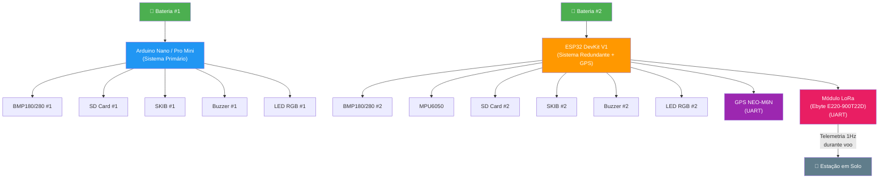
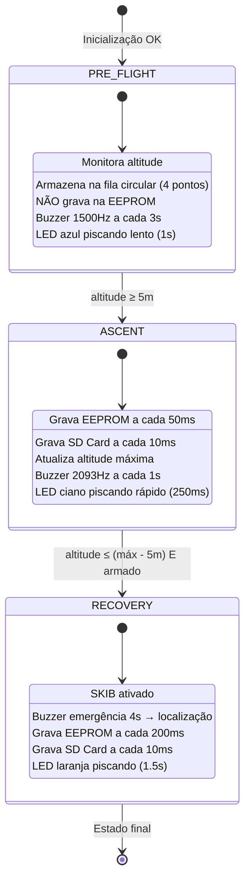

# PRD — Computador de Bordo para Minifoguete
## Projeto: Cangaço no Espaço

**Versão do Documento:** 1.3  
**Data:** 21 de Abril de 2026  
**Baseado em:** Firmware `recovery.ino` (v3.2, Junho 2025), documentação técnica existente e código auxiliar

---

## 1. Visão Geral do Produto

### 1.1. O que é

O **Computador de Bordo** é um sistema eletrônico embarcado projetado para minifoguetes de modelismo. Ele é responsável por:

- **Monitorar** a altitude em tempo real durante todas as fases do voo
- **Detectar automaticamente** as fases do voo (pré-voo, ascensão, apogeu e descida)
- **Acionar o sistema de recuperação** (paraquedas/SKIB) no momento correto do apogeu
- **Registrar dados de voo** para análise posterior (EEPROM e Cartão SD)
- **Fornecer feedback** sonoro e visual sobre o estado do sistema em tempo real

### 1.2. Contexto e Motivação

O sistema foi desenvolvido para o projeto **Cangaço no Espaço**, uma equipe de foguetemodelismo. A necessidade principal é garantir a **recuperação segura** do minifoguete após atingir o apogeu, acionando automaticamente o mecanismo de ejeção do paraquedas (SKIB) e registrando dados da trajetória para análise de desempenho.

Durante um voo real, vibrações, forças G elevadas e impactos podem causar **desconexão de componentes da bateria**. Para mitigar esse risco, o sistema adota uma arquitetura de **redundância dupla**: dois computadores de bordo independentes (Arduino Nano e ESP32) operam **simultaneamente em paralelo**, cada um com seus próprios sensores, armazenamento e SKIB. Se um sistema falhar ou perder energia durante o voo, o outro mantém a capacidade de acionar o paraquedas e registrar os dados.

### 1.3. Público-Alvo

- Membros da equipe Cangaço no Espaço
- Equipes de foguetemodelismo que precisam de um computador de bordo confiável e de baixo custo


---

## 2. Arquitetura de Hardware — Sistema Dual com Redundância

### 2.1. Filosofia de Redundância

O computador de bordo utiliza uma arquitetura de **redundância ativa em paralelo**: dois microcontroladores independentes são embarcados no minifoguete e operam **simultaneamente** durante todo o voo. **Cada sistema possui sua própria bateria**, eliminando um ponto único de falha na alimentação.



**Por que redundância?**

- **Cada sistema tem sua própria bateria** — se uma bateria desconecta durante o voo, o outro sistema continua operando
- Durante voos reais, **vibrações e forças G** podem desconectar fios e componentes
- Um **impacto ou falha mecânica** pode danificar uma placa sem afetar a outra
- Se o sistema primário (Nano) perder energia, o ESP32 **continua operando de forma independente**, garantindo acionamento do SKIB e registro de dados
- Se o ESP32 falhar, o Arduino Nano mantém toda a funcionalidade crítica
- **Cada sistema possui seu próprio SKIB**, garantindo ejeção do paraquedas mesmo com falha de um módulo

> [!CAUTION]
> Os dois sistemas são completamente **independentes e não se comunicam entre si**. Cada sistema possui sua própria bateria, sensores, armazenamento e SKIB. Cada um executa sua própria máquina de estados de forma autônoma. Não há coordenação — a redundância é por isolamento total.

### 2.2. Sistema Primário — Arduino Nano (`recovery.ino`)

| Item | Especificação |
|------|---------------|
| **Microcontrolador** | Arduino Nano (ATmega328P) |
| **Papel** | Sistema primário de recuperação e registro de dados |
| **Sensor Barométrico** | BMP180 ou BMP280 (I2C) — sensor dedicado (ver seção 2.5) |
| **Acelerômetro** | Não possui |
| **Armazenamento Primário** | EEPROM interna (1KB) |
| **Armazenamento Secundário** | Cartão SD via SPI |
| **Comunicação Serial** | 9600 baud |
| **Alimentação** | Bateria dedicada — 5V via regulador |

> [!TIP]
> **Alternativa futura:** O Arduino **Pro Mini** (ATmega328P) pode substituir o Nano neste sistema. Ambos usam o mesmo microcontrolador e o código é compatível sem alterações. Vantagens do Pro Mini: menor tamanho (33×18mm vs 45×18mm), menor peso, e disponível em versão **3.3V/8MHz** que reduz consumo de energia. Desvantagem: requer adaptador FTDI externo para programação. Ver seção 2.6 para detalhes.

### 2.3. Sistema Redundante — ESP32 DevKit V1 (`recoveryESP`)

| Item                         | Especificação                                                                        |
| ---------------------------- | ------------------------------------------------------------------------------------ |
| **Microcontrolador**         | ESP32 DevKit V1 (ESP-WROOM-32)                                                       |
| **Papel**                    | Sistema redundante — backup completo de recuperação, dados, localização e telemetria |
| **Sensor Barométrico**       | BMP180 ou BMP280 (I2C) — sensor dedicado (ver seção 2.5)                             |
| **Acelerômetro**             | MPU6050 (I2C) — 8G, 500°/s, filtro 21Hz                                              |
| **GPS**                      | NEO-M6N (UART) — posição 1Hz, precisão ~2.5m CEP (ver seção 2.7)                     |
| **Rádio LoRa**               | SX1276 / Ra-02 (SPI) — telemetria em tempo real (ver seção 2.7)                      |
| **Armazenamento Primário**   | EEPROM emulada (Flash)                                                               |
| **Armazenamento Secundário** | Cartão SD via SPI                                                                    |
| **Comunicação Serial**       | 115200 baud                                                                          |
| **Alimentação**              | Bateria dedicada (separada do sistema primário) — 3.3V via regulador                 |

> [!IMPORTANT]
> O sistema redundante (ESP32 DevKit V1) **adiciona um acelerômetro MPU6050** que o sistema primário não possui, capturando dados de aceleração nos 3 eixos (X, Y, Z) e armazenando-os no SD Card junto com os dados de altitude. Os dados do acelerômetro também são armazenados na fila pré-voo para registro retroativo. Isso faz com que, além da redundância, o sistema ESP32 forneça **dados complementares** para análise do voo.

### 2.4. Tabela Comparativa dos Sistemas

| Característica | Arduino Nano (Primário) | ESP32 DevKit V1 (Redundante) |
|----------------|:-----------------------:|:----------------------------:|
| Barômetro BMP180/BMP280 | ✅ | ✅ |
| Acelerômetro MPU6050 | ❌ | ✅ |
| GPS NEO-M6N | ❌ | ✅ |
| Rádio LoRa (E220-900T22D) | ❌ | ✅ |
| EEPROM | 1KB nativa | Emulada (Flash) |
| Cartão SD | ✅ | ✅ |
| SKIB independente | ✅ | ✅ |
| Buzzer | ✅ | ✅ |
| LED RGB | ✅ | ✅ |
| Dados de altitude | ✅ | ✅ |
| Dados de aceleração | ❌ | ✅ (3 eixos) |
| Posição GPS em tempo real | ❌ | ✅ (1 Hz durante voo) |
| Telemetria LoRa | ❌ | ✅ |
| Bateria própria | ✅ | ✅ |
| Lógica de voo idêntica | ✅ | ✅ |

### 2.5. Sensor Barométrico — BMP180 ou BMP280

O projeto suporta dois sensores barométricos. A escolha final está **em aberto** e pode variar entre os sistemas:

| Característica | BMP180 | BMP280 |
|----------------|:------:|:------:|
| Interface | I2C | I2C e SPI |
| Resolução de pressão | 1 Pa | 0.16 Pa |
| Faixa de temperatura | 0 a +65°C | -40 a +85°C |
| Consumo de energia | ~12 µA | ~2.7 µA |
| Filtro interno IIR | ❌ | ✅ |
| Endereço I2C padrão | 0x77 | 0x76 ou 0x77 |
| Biblioteca Arduino | `SFE_BMP180.h` | `Adafruit_BMP280.h` |
| Status | Descontinuado | Ativo |

**Implicações na migração para BMP280:**

- As bibliotecas têm APIs **completamente diferentes** — não é uma troca direta
- `SFE_BMP180` usa máquina de estados com `delay()` entre medições
- `Adafruit_BMP280` usa chamadas diretas: `bmp.readPressure()`, `bmp.readAltitude(baseline)`
- O BMP280 tem filtro IIR nativo, o que pode **reduzir ou eliminar a necessidade** da média móvel implementada em software
- O endereço I2C pode ser diferente (verificar com I2C scanner)

> [!NOTE]
> A decisão de qual sensor usar pode ser tomada independentemente para cada sistema. Por exemplo: BMP180 no Arduino Nano e BMP280 no ESP32, ou vice-versa. O firmware deve ser adaptado conforme o sensor escolhido.

### 2.6. Arduino Pro Mini como Alternativa Futura

O **Arduino Pro Mini** é uma alternativa direta ao Nano para o sistema primário:

| Característica | Arduino Nano | Arduino Pro Mini |
|----------------|:------------:|:----------------:|
| Microcontrolador | ATmega328P | ATmega328P |
| Tamanho | 45×18mm | 33×18mm |
| USB integrado | ✅ | ❌ (requer FTDI) |
| Variantes de tensão | 5V/16MHz | 3.3V/8MHz ou 5V/16MHz |
| Pinos digitais | 14 (6 PWM) | 14 (6 PWM) |
| Pinos analógicos | 8 (A0-A7) | 6 no header (A0-A5), A6-A7 em pads SMD |
| I2C / SPI / UART | ✅ | ✅ |
| Compatibilidade de código | — | 100% (mesmo chip) |

**Vantagens para o projeto:**
- **Menor e mais leve** — importante para minifoguetes
- Versão **3.3V/8MHz** consome menos energia
- Código **idêntico** ao do Nano (selecionar placa correta na IDE)

**Considerações:**
- A versão 3.3V/8MHz opera com clock **pela metade** — verificar se o timing de 50ms para leitura do sensor não é afetado
- Necessita de adaptador FTDI para programação (inconveniente para testes frequentes)
- Os pinos A6 e A7 podem não estar acessíveis dependendo do modelo (não afeta este projeto pois não são usados)

---

## 2.7. Sistema de Localização e Telemetria — GPS NEO-M6N + LoRa

Este subsistema é integrado **exclusivamente ao ESP32** e tem como objetivo principal **garantir a recuperação física do foguete** mesmo em caso de falha total da bateria ou destruição parcial do veículo durante o voo.

### 2.7.1. Motivação e Filosofia do Subsistema

Mesmo com o buzzer de localização (RF-06) e o paraquedas ativo, um foguete pode pousar em área de difícil acesso, mata ou fora do campo visual da equipe. Se, adicionalmente, a bateria desconectar no impacto, o buzzer também para — tornando a localização impossível.

A solução é transmitir as coordenadas GPS **continuamente durante o voo**, de forma que, independentemente do estado final do foguete, a **última posição conhecida** seja sempre registrada na estação em solo.

### 2.7.2. Componentes do Subsistema

| Componente | Modelo | Interface | Função |
|------------|--------|:---------:|--------|
| Módulo GPS | NEO-M6N | UART (9600 baud) | Aquisição de posição geográfica |
| Módulo LoRa | Ebyte E220-900T22D (868/915 MHz) | UART (Serial3) + M0/M1 GPIO | Transmissão de dados sem fio de longo alcance |

#### GPS — NEO-M6N

| Parâmetro | Valor |
|-----------|-------|
| **Protocolo** | NMEA 0183 via UART |
| **Taxa de atualização** | 1 Hz (padrão de fábrica) |
| **Precisão horizontal** | ~2.5m CEP (céu aberto) |
| **Tensão de operação** | 3.3V (verificar módulo) |
| **Baudrate UART** | 9600 baud (padrão) |
| **Sentença utilizada** | `$GPRMC` — posição, velocidade e timestamp |
| **Tempo de fix frio** | ~30s (primeira aquisição) |
| **Tempo de fix quente** | ~1s |

> [!TIP]
> O GPS deve ser **ligado e aguardar fix** durante o procedimento pré-lançamento na rampa. Recomenda-se um tempo mínimo de 60 segundos entre ligar o sistema e lançar, para garantir que o fix esteja estável antes da decolagem.

> [!WARNING]
> O NEO-M6N pode perder o fix de satélite durante acelerações muito elevadas (> 4G). Contudo, como a transmissão é contínua desde o PRE_FLIGHT, a **última posição registrada antes da perda de fix** ainda é preservada em solo, cumprindo o objetivo principal do subsistema.

#### Rádio LoRa — Ebyte E220-900T22D

| Parâmetro | Valor |
|-----------|-------|
| **Chip** | LLCC68 (Semtech) |
| **Frequência** | 850.125–930.125 MHz (padrão: 873.125 MHz) |
| **Potência de transmissão** | 21.5–22.5 dBm |
| **Sensibilidade de recepção** | -146 a -148 dBm |
| **Air Data Rate** | 2.4k–62.5 kbps (configurável) |
| **Alcance estimado** | até 5 km em campo aberto (LOS) |
| **Interface** | **UART** (TTL 3.3V, 9600 baud padrão) |
| **Pinos de controle** | M0, M1 (seleção de modo de operação) |
| **Tensão de operação** | 2.3–5.5V (nível lógico 3.3V) |
| **Corrente TX** | ~110 mA |
| **Corrente RX** | ~16.8 mA |
| **Corrente Sleep** | ~5 µA |
| **Tamanho** | 21×36 mm |
| **Antena** | SMA-K (externa) |
| **Buffer TX** | 200 bytes |

> [!IMPORTANT]
> O E220-900T22D usa **interface UART**, não SPI. Isso é uma diferença fundamental em relação ao Ra-02/SX1276. O módulo possui sua própria camada de protocolo interna (LLCC68) e é controlado via comandos AT enviados pelo UART, além dos pinos M0 e M1 que definem o modo de operação.

**Modos de operação (M0 / M1):**

| M0 | M1 | Modo | Descrição |
|:--:|:--:|------|-----------|
| 0 | 0 | Transmissão normal | Modo padrão de TX/RX transparente |
| 0 | 1 | WOR (Wake-on-Radio) | TX: envia preamble para acordar receptores em sleep |
| 1 | 0 | Configuração | Permite leitura/escrita de parâmetros via UART |
| 1 | 1 | Sleep | Consumo mínimo (~5 µA) |

> [!NOTE]
> Durante o voo, o módulo deve operar em **Modo Normal (M0=0, M1=0)**. Os pinos M0 e M1 devem ser fixados em LOW via GPIO do ESP32 após a inicialização. A frequência padrão de 873.125 MHz está na banda ISM e é compatível com uso no Brasil — verificar regulamentação ANATEL vigente antes do lançamento.

### 2.7.3. Arquitetura de Operação

O sistema GPS+LoRa opera **em paralelo** com a lógica de voo existente do ESP32, sem interferir com as funções de recuperação. A lógica de transmissão é não-bloqueante, baseada em `millis()`, respeitando a arquitetura já estabelecida no RF-08.

O E220-900T22D comunica-se via **UART** em modo transparente — o ESP32 simplesmente escreve o payload no Serial (UART3) e o módulo transmite automaticamente, sem necessidade de gerenciar pacotes LoRa manualmente em nível de camada física.

```
loop() do ESP32 (com GPS+LoRa):
├── [existente] Leitura BMP → altitude barométrica
├── [existente] Leitura MPU6050 → aceleração
├── [existente] Máquina de estados de voo
├── [existente] Gravação EEPROM / SD Card
├── [NOVO] Leitura NMEA do GPS (não-bloqueante, via Serial2)
└── [NOVO] Transmissão LoRa a cada 1s — Serial.print() via UART3 (E220)
```

**Inicialização do E220 no `setup()`:**
```cpp
// Configurar pinos de modo
pinMode(PIN_LORA_M0, OUTPUT);
pinMode(PIN_LORA_M1, OUTPUT);
digitalWrite(PIN_LORA_M0, LOW);   // Modo Normal
digitalWrite(PIN_LORA_M1, LOW);   // Modo Normal

// Inicializar UART do módulo LoRa
Serial1.begin(9600, SERIAL_8N1, PIN_LORA_RX, PIN_LORA_TX);
delay(100); // Aguardar módulo estabilizar
```

### 2.7.4. Protocolo de Transmissão LoRa

Cada pacote transmitido contém os seguintes campos, codificados em texto simples (CSV) para facilidade de decodificação na estação em solo:

```
CANGACO,<timestamp_ms>,<lat>,<lon>,<alt_gps>,<alt_baro>,<estado>,<fix>
```

| Campo | Tipo | Exemplo | Descrição |
|-------|------|---------|-----------|
| `CANGACO` | string | `CANGACO` | Identificador do foguete (evita colisão com outros transmissores LoRa) |
| `timestamp_ms` | uint32 | `12450` | Tempo de voo em ms desde a decolagem |
| `lat` | float (6 dec.) | `-7.115234` | Latitude em graus decimais |
| `lon` | float (6 dec.) | `-34.861023` | Longitude em graus decimais |
| `alt_gps` | float (1 dec.) | `145.3` | Altitude GPS em metros (MSL) |
| `alt_baro` | float (1 dec.) | `142.7` | Altitude barométrica em metros (relativa ao solo) |
| `estado` | uint8 | `1` | Estado de voo: 0=PRE_FLIGHT, 1=ASCENT, 2=RECOVERY |
| `fix` | uint8 | `2` | Qualidade do fix GPS: 0=sem fix, 1=fix 2D, 2=fix 3D |

**Exemplo de pacote:**
```
CANGACO,12450,-7.115234,-34.861023,145.3,142.7,1,2
```

**Tamanho estimado do pacote:** ~55 bytes — dentro do limite de 200 bytes do buffer TX do E220-900T22D, sem necessidade de fragmentação.

> [!IMPORTANT]
> Mesmo sem fix GPS (campos `lat`, `lon`, `alt_gps` zerados e `fix=0`), o pacote **continua sendo transmitido** com a altitude barométrica e o estado de voo. Isso garante telemetria parcial mesmo em condições de sinal GPS degradado.

### 2.7.5. Janela de Transmissão

O sistema transmite **durante todos os estados de voo**, iniciando já no PRE_FLIGHT:

| Estado | Transmissão LoRa | Justificativa |
|--------|:----------------:|---------------|
| PRE_FLIGHT | ✅ 1 Hz | Confirma link ativo e fix GPS antes do lançamento |
| ASCENT | ✅ 1 Hz | Rastreia trajetória em tempo real |
| RECOVERY | ✅ 1 Hz | **Crítico** — registra posição de pouso mesmo se a bateria desconectar |

> [!CAUTION]
> A transmissão em PRE_FLIGHT **não deve ser desativada**. É durante essa fase que a equipe confirma que o link LoRa está funcionando e que o GPS tem fix antes de autorizar o lançamento.

### 2.7.6. Estação em Solo (Fora do Escopo Deste PRD)

A estação receptora em solo é um sistema separado, composto por um módulo **E220-900T22D idêntico** conectado a um computador ou microcontrolador receptor via UART. Por operar em modo transparente, a estação em solo recebe os pacotes CSV diretamente na porta serial, sem necessidade de biblioteca LoRa específica. O desenvolvimento da estação em solo está **fora do escopo deste PRD** e será definido em documento próprio.

Requisitos mínimos da estação em solo:
- Módulo E220-900T22D configurado com o mesmo endereço e canal do módulo embarcado
- Pinos M0 e M1 em LOW (Modo Normal)
- Receber e decodificar os pacotes CSV via UART (9600 baud)
- Registrar a **última posição GPS recebida** com timestamp
- Exibir as coordenadas em tempo real (ex: terminal serial ou mapa)

---

## 3. Hardware e Pinagem

### 3.1. Componentes Obrigatórios (Sistema Completo com Redundância)

| Componente | Função | Qtd (Nano) | Qtd (ESP32) | Total |
|------------|--------|:----------:|:-----------:|:-----:|
| Arduino Nano (ATmega328P) | Processamento central (primário) | 1 | — | 1 |
| ESP32 DevKit V1 | Processamento central (redundante) | — | 1 | 1 |
| Sensor BMP180 **ou** BMP280 | Medição de pressão e temperatura | 1 | 1 | **2** |
| Buzzer ativo/passivo | Feedback sonoro | 1 | 1 | **2** |
| LED RGB (cátodo comum) | Feedback visual | 1 | 1 | **2** |
| SKIB (ignitor/servo) | Ejeção do paraquedas | 1 | 1 | **2** |
| Módulo SD Card | Armazenamento de alta resolução | 1 | 1 | **2** |
| MPU6050 | Aceleração e giroscópio | — | 1 | 1 |
| GPS NEO-M6N | Localização geográfica | — | 1 | 1 |
| Módulo LoRa Ebyte E220-900T22D | Telemetria e localização em tempo real | — | 1 | 1 |
| Bateria LiPo | Alimentação independente | 1 | 1 | **2** |

> [!IMPORTANT]
> Cada sistema possui **seus próprios sensores, SKIB e bateria**. NADA é compartilhado entre as placas. Isso garante que a falha de um sistema não comprometa o outro.

### 3.2. Mapeamento de Pinos — Arduino Nano

> [!CAUTION]
> O código original mapeava o SKIB no pino **D1 (TX Serial)**, que emite sinais durante o boot e `Serial.begin()`. Isso poderia causar acionamento acidental do mecanismo pirotécnico ao ligar o sistema. A pinagem abaixo já está **corrigida e revisada** — todos os pinos usados são seguros durante o boot.

```
Pino    Função              Observações
─────   ──────────────────  ──────────────────────────────────────────
D7      SKIB                Pino seguro, sem atividade no boot
D2      Buzzer              Saída para tons sonoros via tone()
D3      LED Azul (RGB)      PWM — Na PCB atual está invertido com o verde
D5      LED Verde (RGB)     PWM — Na PCB atual está invertido com o azul
D6      LED Vermelho (RGB)  PWM
D10     SPI CS (SD Card)    Chip Select do módulo SD
D11     SPI MOSI            Dados para o SD Card
D12     SPI MISO            Dados do SD Card
D13     SPI SCK             Clock do SD Card
A4      I2C SDA             Dados do BMP180/BMP280
A5      I2C SCL             Clock do BMP180/BMP280
```

> [!NOTE]
> Esta pinagem é **100% compatível com o Arduino Pro Mini**, possibilitando troca futura sem alteração de código.

> [!WARNING]
> Na PCB atual do computador de bordo, os pinos do LED verde e azul estão **fisicamente invertidos**. Se uma nova PCB for fabricada, corrigir essa inversão.

### 3.3. Mapeamento de Pinos — ESP32 DevKit V1

> [!CAUTION]
> O código original mapeava o SKIB no **GPIO14 (pino JTAG TMS)**, que pode emitir pulsos PWM transitórios durante o boot. A pinagem abaixo já está **corrigida e revisada** — todos os pinos usados são seguros. Pinos proibidos (strapping, UART, Flash SPI, JTAG) foram evitados.

```
Pino    Função              Observações
─────   ──────────────────  ──────────────────────────────────────────
GPIO4   SKIB                Pino seguro, sem função especial no boot
GPIO13  Buzzer              Via ledcWriteTone() — tone() não existe no ESP32
GPIO26  LED Vermelho (RGB)  Via LEDC PWM (ledcWrite)
GPIO25  LED Verde (RGB)     Via LEDC PWM (ledcWrite)
GPIO27  LED Azul (RGB)      Via LEDC PWM (ledcWrite)
GPIO5   SPI CS (SD Card)    Strapping pin, mas seguro para CS após boot
GPIO23  SPI MOSI            Dados para o SD Card
GPIO19  SPI MISO            Dados do SD Card
GPIO18  SPI SCK             Clock do SD Card
GPIO21  I2C SDA             Dados do BMP180/BMP280 e MPU6050
GPIO22  I2C SCL             Clock do BMP180/BMP280 e MPU6050
GPIO16  UART2 RX (GPS)      Recepção NMEA do GPS NEO-M6N (Serial2)
GPIO17  UART2 TX (GPS)      Transmissão para o GPS NEO-M6N (Serial2, opcional)
GPIO14  UART1 RX (LoRa)     Recepção de dados do E220-900T22D (Serial1)
GPIO12  UART1 TX (LoRa)     Transmissão de dados ao E220-900T22D (Serial1)
GPIO32  LoRa M0             Controle de modo do E220 — LOW em operação normal
GPIO33  LoRa M1             Controle de modo do E220 — LOW em operação normal
```

> [!NOTE]
> O E220-900T22D usa **UART**, não SPI. O barramento SPI do ESP32 agora é **exclusivo do SD Card**, eliminando qualquer conflito de CS. Os pinos M0 e M1 devem ser mantidos em LOW durante todo o voo (Modo Normal). Configurações do módulo (endereço, canal, air rate) devem ser feitas em bancada antes do lançamento, colocando M0=HIGH, M1=HIGH para entrar em modo de configuração.

> [!NOTE]
> O pino TX do GPS (GPIO17) é opcional — a comunicação NMEA é unidirecional na maioria dos casos. O TX pode ser necessário para reconfigurar a taxa de atualização do GPS por firmware.

> [!WARNING]
> GPIO12 é um pino strapping no ESP32 — se estiver em HIGH durante o boot, o flash opera em tensão errada e o dispositivo falha. Garantir que o TX do E220 (conectado ao GPIO12/RX do ESP32) esteja em LOW ou desconectado durante o boot. Uma resistência pull-down de 10kΩ no GPIO12 é recomendada.

---

## 4. Requisitos Funcionais

### RF-01: Inicialização do Sistema (`setup`)

**Descrição:** Ao ligar, o sistema deve inicializar todos os periféricos, verificar sua integridade e calibrar a pressão de referência (baseline).

**Sequência de inicialização:**

1. Iniciar comunicação serial
2. Configurar todos os pinos de saída (LEDs, buzzer, SKIB)
3. Acender LED azul indicando boot em andamento
4. Inicializar módulo SD Card
5. Inicializar sensor BMP180 (e MPU6050 na versão ESP32)
6. **Se tudo OK:**
   - Exibir LED verde por 1 segundo
   - Prosseguir para calibração
7. **Se houver falha:**
   - Entrar em loop infinito de erro com indicação visual:

| Falha | Cor do LED piscando |
|-------|---------------------|
| Altímetro E SD Card | 🔴 Vermelho |
| Apenas SD Card | 🟡 Amarelo |
| Apenas Altímetro | 🟣 Magenta |

8. Ler pressão base da EEPROM (ou medir se inválida)
9. Recalibrar baseline com pressão atmosférica atual
10. Inicializar fila circular pré-voo

**Critério de aceite:** O sistema NÃO deve prosseguir para o loop principal caso algum sensor essencial falhe. Deve permanecer em estado de erro visível.

---

### RF-02: Máquina de Estados de Voo

O sistema opera em uma **máquina de 3 estados** com transições unidirecionais:



#### 4.2.1. Estado PRE_FLIGHT (Pré-Voo)

| Aspecto | Comportamento |
|---------|---------------|
| **Objetivo** | Monitorar altitude e aguardar decolagem |
| **Gravação EEPROM** | ❌ Não grava (economiza espaço) |
| **Gravação SD Card** | ❌ Não grava |
| **Fila Circular** | Armazena últimas 4 altitudes suavizadas |
| **LED RGB** | 🔵 Azul, piscando a cada 1s |
| **Buzzer** | 1500 Hz, beep a cada 3s por 400ms |
| **Transição de saída** | `smoothedAltitude ≥ ASCENT_THRESHOLD (5.0m)` |
| **Ao sair** | Salva os pontos da fila pré-voo na EEPROM e começa a contar o tempo de voo |

#### 4.2.2. Estado ASCENT (Ascensão)

| Aspecto | Comportamento |
|---------|---------------|
| **Objetivo** | Capturar dados de voo em alta resolução e detectar o apogeu |
| **Gravação EEPROM** | ✅ A cada 50ms (20 Hz) |
| **Gravação SD Card** | ✅ A cada 10ms (100 Hz) |
| **LED RGB** | 🩵 Ciano, piscando rápido a cada 250ms |
| **Buzzer** | 2093 Hz, beep a cada 1s por 400ms |
| **Transição de saída** | `alturasSuavizadas[0] ≤ maxAltitude - DESCENT_DETECTION_THRESHOLD (5.0m)` E `armado == true` |
| **Ao sair** | Ativa sistema de recuperação (SKIB) |

#### 4.2.3. Estado RECOVERY (Recuperação)

| Aspecto | Comportamento |
|---------|---------------|
| **Objetivo** | Garantir recuperação segura e facilitar localização |
| **Gravação EEPROM** | ✅ A cada 200ms (5 Hz) |
| **Gravação SD Card** | ✅ A cada 10ms (100 Hz) |
| **SKIB** | Ativado por 2 segundos, depois desligado |
| **LED RGB** | 🟠 Laranja, piscando a cada 1.5s |
| **Buzzer de Emergência** | 3136 Hz contínuo por 4 segundos na ativação |
| **Buzzer de Localização** | 2637 Hz, beep a cada 500ms (pós-SKIB) |
| **Transição de saída** | Nenhuma — estado terminal |

---

### RF-03: Sistema de Recuperação (SKIB)

**Descrição:** O SKIB (Sistema de Kick-back de Ignição de Backup — mecanismo pirotécnico ou servo para ejeção do paraquedas) é o componente mais crítico do sistema.

**Requisitos:**

1. O SKIB deve ser acionado **automaticamente** quando o apogeu for detectado
2. O acionamento consiste em colocar o pino do SKIB em nível HIGH
3. O SKIB deve permanecer ativo por exatamente `SKIB_DEACTIVATION_TIME` (2000ms)
4. Após o timeout, o pino deve ser desligado (LOW)
5. O sistema deve **salvar a altitude máxima na EEPROM** no momento da ativação
6. Um buzzer de emergência de 4 segundos deve soar na ativação
7. O sistema deve **impedir ativações múltiplas** usando a flag `armado`
8. Uma vez desarmado (`armado = false`), o SKIB **nunca** deve ser reativado no mesmo voo

**Sequência de ativação:**
```
activateRecoverySystem()
├── ativaSkib()              → PIN_SKIB = HIGH
├── armado = false           → Impede reativação
├── isDescending = true
├── currentState = RECOVERY
├── LED = Vermelho
├── skibActivatedAt = millis()
├── saveMaxAltitude()        → Grava na EEPROM
├── tone(BUZZER, 3136Hz)     → Buzzer emergência
└── skibBuzzerEndTime = +4s  → Timer para fim do buzzer
```

> [!CAUTION]
> O SKIB é o mecanismo que ejeta o paraquedas. Uma falha no acionamento resulta em **perda total** do foguete. Uma ativação prematura pode causar **comportamento errático** durante o voo. Este é o requisito de mais alta criticidade do sistema.

---

### RF-11: Segurança de Hardware do SKIB

> [!CAUTION]
> **A segurança do SKIB NÃO pode depender apenas de software.** Durante o boot, reset ou falha do microcontrolador, os pinos GPIO ficam em estado indefinido por milissegundos. Um pulso de apenas 1ms em um ignitor pirotécnico pode ser suficiente para ativação. As proteções abaixo são **OBRIGATÓRIAS**.

#### 11.1. Problemas Identificados no Código Original

| Sistema | Pino Original | Problema | Severidade |
|---------|:-------------:|---------|:----------:|
| Arduino Nano | **D1 (TX)** | Emite dados seriais durante boot e `Serial.begin()` | 🔴 **CRÍTICO** |
| ESP32 DevKit V1 | **GPIO14 (JTAG TMS)** | Pode emitir pulsos PWM transitórios durante boot | 🟡 **ALTO** |

#### 11.2. Requisitos de Hardware Obrigatórios

1. **Resistor pull-down no pino do SKIB (10kΩ)**
   - Conectar um resistor de 10kΩ entre o pino do SKIB e GND
   - Garante que o pino permaneça LOW durante o boot, reset e enquanto o firmware não assume controle
   - **Obrigatório em ambos os sistemas**

2. **MOSFET ou transistor de potência**
   - O Arduino/ESP32 **NÃO deve acionar o ignitor diretamente** pelo GPIO
   - Usar um MOSFET (ex: IRLZ44N) ou transistor (ex: TIP120) como driver de potência
   - O GPIO controla apenas o gate/base do transistor (baixa corrente)
   - O pull-down no gate garante estado seguro antes do boot

3. **Chave de armamento físico (recomendado)**
   - Chave mecânica em série com a alimentação do ignitor
   - O SKIB só pode ser acionado se a chave estiver ligada
   - Permite armar o sistema apenas quando o foguete estiver na rampa
   - **Independente de software** — mesmo que o Arduino falhe, a chave impede ativação

#### 11.3. Circuito de Segurança Recomendado

```
                    Chave de        MOSFET
  Bateria ──────── Armamento ──────┤ Drain
  do SKIB           (físico)       │
                                   │ Source ── GND
                                   │
  GPIO (D7/GPIO4) ── 10kΩ pull-down ── Gate
                         │
                        GND
```

**Sequência segura:**
1. Sistema liga → GPIO em alta impedância → pull-down mantém gate LOW → MOSFET OFF → SKIB seguro
2. Firmware inicializa → `pinMode(SKIB, OUTPUT)` + `digitalWrite(SKIB, LOW)` → Pull-down reforçado
3. Apogeu detectado → `digitalWrite(SKIB, HIGH)` → gate HIGH → MOSFET ON → SKIB ativado
4. Timeout → `digitalWrite(SKIB, LOW)` → MOSFET OFF → SKIB desativado

#### 11.4. Primeira Instrução do `setup()`

O pino do SKIB deve ser configurado como **a primeira instrução** do `setup()`, **antes de `Serial.begin()`**:

```cpp
void setup() {
  // PRIMEIRO: Garantir SKIB desligado ANTES de qualquer outra coisa
  pinMode(PIN_SKIB, OUTPUT);
  digitalWrite(PIN_SKIB, LOW);
  
  // Só então inicializar serial e outros periféricos
  Serial.begin(9600);
  // ...
}
```

---

### RF-04: Aquisição e Processamento de Altitude

#### 4.4.1. Leitura do Sensor BMP180

**Processo de leitura (função `getPressure()`):**

1. Iniciar medição de temperatura (`startTemperature()`) — ~5ms
2. Ler temperatura (`getTemperature(T)`)
3. Iniciar medição de pressão com resolução 1 (`startPressure(1)`) — ~8ms
4. Ler pressão (`getPressure(P, T)`)
5. Retornar pressão em hPa, ou `-1` em caso de erro

**Tempo total:** ~15ms por leitura  
**Frequência real:** ~20 Hz (limitada pelo sensor)

> [!NOTE]
> A função `getPressure()` é a **única função com `delay()` bloqueante** no sistema. Esses delays são necessários pois o sensor BMP180 requer tempo físico para completar a conversão analógico-digital.

#### 4.4.2. Cálculo de Altitude

A altitude é calculada pela função `pressure.altitude(P, baseline)` da biblioteca `SFE_BMP180`, que utiliza a fórmula barométrica:

```
altitude = 44330 × (1 - (P / baseline)^(1/5.255))
```

Onde:
- `P` = pressão medida (hPa)
- `baseline` = pressão ao nível de referência do solo (hPa)

#### 4.4.3. Suavização de Altitude (Média Móvel)

**Algoritmo:** Média móvel simples (SMA) das últimas 5 leituras

**Implementação:** Fila circular de tamanho `WINDOW_SIZE = 5`

```
Entrada: newAltitude (leitura bruta do sensor)
1. Inserir newAltitude na posição atual da fila circular
2. Avançar índice circular: (index + 1) % 5
3. Calcular média de min(totalReadings, 5) amostras
4. Retornar média como altitude suavizada
```

| Propriedade | Valor |
|-------------|-------|
| Redução de ruído | ~55% (para oscilações aleatórias) |
| Atraso introduzido | ~0.25s para estabilizar (5 amostras × 50ms) |
| Memória utilizada | 40 bytes (5 × double de 8 bytes) |

#### 4.4.4. Histórico de Altitudes Suavizadas

Além da fila de suavização, o sistema mantém um **histórico separado de 5 altitudes suavizadas** (`alturasSuavizadas[5]`) para análise de tendência. Este histórico é usado na detecção de apogeu e verificação de estabilidade.

```
Ordem: [0] = mais recente → [4] = mais antigo
Atualização: shift à direita a cada leitura
```

---

### RF-05: Armazenamento de Dados

#### 4.5.1. EEPROM — Armazenamento Primário (Persistente)

**Layout de memória:**

```
┌────────────────────────────────────────────────────────────┐
│ Endereço  │ Tamanho │ Conteúdo               │ Formato     │
├────────────────────────────────────────────────────────────┤
│ 0x00-0x01 │ 2 bytes │ Altitude máxima        │ short × 10  │
│ 0x02-0x05 │ 4 bytes │ Pressão baseline       │ double      │
│ 0x06-0x0D │ 8 bytes │ 4 pontos pré-voo       │ short × 10  │
│ 0x0E-0x3E7│ ~982 B  │ Dados de voo contínuos │ short × 10  │
└────────────────────────────────────────────────────────────┘

Tamanho total utilizado: 1000 bytes
Capacidade: 497 pontos de altitude (994 ÷ 2 bytes)
```

**Compressão de dados:**

- Altitudes `double` (8 bytes) são convertidas para `short int` (2 bytes)
- Fator de escala: `× 10` (preserva 1 casa decimal)
- **Economia:** 75% de espaço em relação ao armazenamento em `double`
- **Faixa representável:** -3276.8m a +3276.7m
- **Precisão:** 0.1 metros
- **Clipping:** Valores fora da faixa são limitados em ±32768

**Capacidade estimada de gravação:**

| Cenário | Pontos | Duração estimada |
|---------|--------|------------------|
| Apenas ascensão (50ms) | 497 | ~25 segundos |
| 4 pré-voo + 200 ascensão + 293 descida | 497 | ~55 segundos |
| Misto típico | ~300-400 | ~30-50 segundos |

#### 4.5.2. Cartão SD — Armazenamento Secundário (Alta Resolução)

**Formato dos dados:**

- Arquivo CSV com nomenclatura `LOG_XX.CSV` (00 a 99, auto-incremento)
- Criação automática do próximo arquivo disponível na inicialização

**Cabeçalho (versão Nano):**
```csv
Timestamp,Altitude,State
```

**Cabeçalho (versão ESP32):**
```csv
Timestamp,Altitude,AccelX,AccelY,AccelZ,State
```

| Aspecto | Especificação |
|---------|---------------|
| **Frequência de gravação** | 10ms (100 Hz) |
| **Início da gravação** | Após sair do estado PRE_FLIGHT |
| **Timestamp** | Tempo de voo em segundos (relativo ao início do voo) |
| **Altitude** | Altitude suavizada em metros |
| **Estado** | String: "PRE_FLIGHT", "ASCENT" ou "RECOVERY" |
| **Flush** | Forçado a cada gravação (segurança contra perda de energia) |

#### 4.5.3. Fila Circular Pré-Voo

**Propósito:** Capturar os últimos pontos de altitude antes da detecção de decolagem, permitindo análise retroativa do momento da ignição.

| Aspecto | Especificação |
|---------|---------------|
| **Tamanho** | 4 pontos |
| **Estrutura** | Fila circular (ring buffer) |
| **Dado armazenado** | Altitude suavizada (`double`) |
| **Quando é salva** | No momento da transição PRE_FLIGHT → ASCENT |
| **Onde é salva** | EEPROM (nos primeiros slots de dados de voo) |

Na versão ESP32, a fila pré-voo também armazena dados do acelerômetro (X, Y, Z) em uma fila circular paralela.

---

### RF-06: Sistema de Feedback Sonoro (Buzzer)

O buzzer fornece identificação auditiva do estado atual do sistema, crucial para operações em campo onde a interface visual pode ser limitada.

#### Tabela de sons por estado:

| Estado | Frequência (Hz) | Nota Musical Aprox. | Período (ms) | Duração (ms) | Caráter |
|--------|:----------------:|:--------------------:|:------------:|:------------:|---------|
| PRE_FLIGHT | 1500 | F#6 | 3000 | 400 | Grave e lento — preparação |
| ASCENT | 2093 | C7 | 1000 | 400 | Médio e rápido — voo ativo |
| RECOVERY (pré-SKIB) | 3136 | G7 | 500 | 400 | Agudo e muito rápido — emergência |
| RECOVERY (pós-SKIB) | 2637 | E7 | 500 | 400 | Tom de localização |
| Ativação SKIB | 3136 | G7 | Contínuo | 4000 | Alerta de emergência |

**Prioridade:** O buzzer do SKIB (4 segundos contínuos) tem **prioridade máxima** e não é interrompido pelo buzzer de estado.

#### Lógica de operação:

```
1. Se buzzer de SKIB ativo → não interferir
2. Determinar período e frequência pelo estado atual
3. Se não está bipando E tempo desde último beep ≥ período:
   → Iniciar tone
4. Se está bipando E tempo desde início do beep ≥ duração:
   → Parar tone
```

---

### RF-07: Sistema de Feedback Visual (LED RGB)

O LED RGB indica o estado do sistema e a presença de erros de forma visualmente distinta.

#### Estados visuais durante operação normal:

| Estado | Cor | Velocidade de Piscar | Código RGB |
|--------|-----|---------------------|------------|
| Boot | 🔵 Azul | Contínuo (fixo) | (0, 0, 255) |
| Sucesso na inicialização | 🟢 Verde | Contínuo por 1s | (0, 255, 0) |
| PRE_FLIGHT | 🔵 Azul | 1000ms (lento) | (0, 0, 255) |
| ASCENT | 🩵 Ciano | 250ms (rápido) | (0, 255, 255) |
| RECOVERY | 🟠 Laranja | 1500ms (mais lento) | (255, 165, 0) |
| Ativação SKIB | 🔴 Vermelho | Contínuo (fixo) | (255, 0, 0) |

#### Estados visuais de erro (na inicialização):

| Cenário de Falha | Cor Piscando | Código RGB |
|-------------------|:------------:|------------|
| Altímetro + SD | 🔴 Vermelho | (255, 0, 0) |
| Apenas SD | 🟡 Amarelo | (255, 255, 0) |
| Apenas Altímetro | 🟣 Magenta | (255, 0, 255) |

**Padrão de erro:** Pisca 500ms ligado / 500ms desligado, em loop infinito.

---

### RF-08: Controle de Tempo Não-Bloqueante

**Requisito:** O loop principal **não deve conter `delay()`** (exceto na leitura do sensor BMP180 que é obrigatória). Todo temporização deve usar a função `millis()`.

**Implementação:**
```
loop():
├── Gravação SD Card        → controlada por lastSdRecordTime + RECORD_INTERVAL_SD
├── Leitura do sensor       → controlada por lastSensorReadTime + SENSOR_READ_INTERVAL
├── Gravação EEPROM         → controlada por lastRecordTime + RECORD_INTERVAL_*
├── Buzzer de estado        → controlada por previousBeepTime + beepPeriod
├── LED de estado           → controlada por (currentTime / blinkSpeed) % 2
└── Buzzer SKIB             → controlada por skibBuzzerEndTime
```

**Justificativa:** O uso de `delay()` bloqueava o sistema por ~50ms por iteração, impedindo que o buzzer, LEDs e verificação de transições de estado operassem em tempo real.

---

### RF-09: Calibração de Baseline

**Descrição:** A "baseline" é a pressão atmosférica de referência do solo. Uma calibração precisa é essencial para cálculos de altitude corretos.

**Processo:**

1. Na inicialização, tenta ler a baseline salva na EEPROM (endereço 2-5)
2. Se o valor lido for inválido (≤ 0), faz uma nova leitura da pressão atual
3. Independentemente, realiza um **reset da baseline** com a pressão atual
4. Salva a nova baseline na EEPROM

> [!TIP]
> A baseline é recalibrada automaticamente a cada boot. Não é necessário calibrar manualmente antes do lançamento, desde que o sistema seja ligado no local de lançamento.

---

### RF-10: Detecção de Fases de Voo

#### 4.10.1. Detecção de Decolagem (PRE_FLIGHT → ASCENT)

**Condição:** `smoothedAltitude >= ASCENT_THRESHOLD (5.0m)`

**Lógica:** Quando a altitude suavizada ultrapassa 5 metros acima do solo, o sistema assume que houve decolagem.

#### 4.10.2. Detecção de Apogeu (ASCENT → RECOVERY)

**Condição:** `alturasSuavizadas[0] <= maxAltitude - DESCENT_DETECTION_THRESHOLD (5.0m)` **E** `armado == true`

**Lógica:** O sistema detecta o apogeu quando a altitude mais recente cai 5 metros abaixo da altitude máxima registrada durante o voo. A flag `armado` garante que a detecção ocorra apenas uma vez.

#### 4.10.3. Verificação de Estabilidade

A função `isAltitudeStable()` verifica se as últimas 3 altitudes suavizadas diferem em menos de 5 metros entre si. Esta função está implementada mas não é utilizada diretamente nas transições atuais.

---

### RF-12: Aquisição de Posição GPS (ESP32)

**Descrição:** O ESP32 deve ler continuamente os dados NMEA enviados pelo GPS NEO-M6N via UART2 e manter atualizada a última posição conhecida.

**Requisitos:**

1. O GPS deve ser inicializado na `setup()` com baudrate de 9600 via `Serial2.begin(9600, SERIAL_8N1, PIN_GPS_RX, PIN_GPS_TX)`
2. A leitura deve ser **não-bloqueante** — processar apenas os bytes disponíveis no buffer UART a cada iteração do `loop()`
3. O sistema deve parsear a sentença `$GPRMC` para extrair: latitude, longitude, velocidade e timestamp UTC
4. A flag `gpsFixValid` deve refletir se o fix atual é válido (`A`) ou inválido (`V`) conforme o campo de status da sentença `$GPRMC`
5. Em caso de fix inválido, manter os últimos valores válidos de lat/lon em memória (não zerar)
6. O módulo GPS deve ser inicializado na `setup()` com verificação de resposta; se não responder em 5 segundos, o sistema deve registrar o erro no SD Card mas **não entrar em loop de erro** — o subsistema GPS é não-crítico para a missão principal de recuperação

**Biblioteca recomendada:** `TinyGPS++` (parsing de NMEA)

**Critério de aceite:** Em condições normais de céu aberto, o sistema deve ter fix válido dentro de 60 segundos após o boot e manter o fix durante o voo.

---

### RF-13: Telemetria LoRa em Tempo Real (ESP32)

**Descrição:** O ESP32 deve transmitir pacotes de telemetria via LoRa a uma taxa de 1 Hz durante todos os estados de voo, desde o PRE_FLIGHT até o fim do estado RECOVERY.

**Requisitos:**

1. O módulo E220-900T22D deve ser inicializado na `setup()` com pinos M0 e M1 em LOW (Modo Normal) e UART configurado a 9600 baud via `Serial1.begin(9600, SERIAL_8N1, PIN_LORA_RX, PIN_LORA_TX)`
2. A transmissão deve ser **não-bloqueante** — disparada por controle de tempo com `millis()`, com intervalo `LORA_TX_INTERVAL = 1000ms`
3. Cada pacote deve seguir o formato CSV definido na seção 2.7.4, terminado com `\n`, e enviado diretamente via `Serial1.println(payload)`
4. Se o GPS não tiver fix válido, os campos `lat`, `lon` e `alt_gps` devem ser enviados como `0.000000`, `0.000000` e `0.0`, com `fix=0`
5. O campo `alt_baro` deve ser sempre preenchido com a altitude barométrica suavizada mais recente, independente do fix GPS
6. O campo `estado` deve refletir o estado atual da máquina de estados de voo (0=PRE_FLIGHT, 1=ASCENT, 2=RECOVERY)
7. Se o módulo não responder na inicialização, registrar o erro no SD Card e **continuar a operação normal** — o subsistema LoRa é não-crítico para a missão principal de recuperação
8. A transmissão LoRa **não deve interferir** com os intervalos de gravação de EEPROM, SD Card ou leitura de sensores

**Constantes configuráveis:**

| Constante | Valor Padrão | Descrição |
|-----------|:------------:|-----------|
| `LORA_TX_INTERVAL` | 1000 ms | Intervalo entre transmissões |
| `LORA_UART_BAUD` | 9600 | Baudrate UART com o E220-900T22D |
| `LORA_FREQUENCY_MHZ` | 873.125 | Frequência de operação do módulo (MHz) |
| `PIN_LORA_M0` | GPIO32 | Pino de controle de modo M0 |
| `PIN_LORA_M1` | GPIO33 | Pino de controle de modo M1 |

**Critério de aceite:** A estação em solo deve receber ao menos 1 pacote por segundo com `fix=2` durante todo o voo em campo aberto. A última posição recebida deve ser registrada pela estação em solo mesmo que o foguete pare de transmitir após o pouso.

---

### RNF-01: Temporização

| Parâmetro | Valor | Justificativa |
|-----------|-------|---------------|
| Frequência do loop principal | ≥ 50 Hz | Responsividade do sistema |
| Leitura do sensor | 50ms (20 Hz) | Limitação do BMP180 |
| Gravação EEPROM (ascensão) | 50ms (20 Hz) | Máxima resolução na fase crítica |
| Gravação EEPROM (descida) | 200ms (5 Hz) | Economia de espaço |
| Gravação SD Card | 10ms (100 Hz) | Alta resolução temporal |
| Duração do SKIB ativo | 2000ms | Tempo suficiente para ejeção |
| Duração buzzer emergência | 4000ms | Alerta audível de ativação |

### RNF-02: Confiabilidade e Redundância

- O sistema deve funcionar mesmo sem cartão SD (usando apenas EEPROM)
- Leituras inválidas do sensor (retorno -1) devem ser ignoradas sem afetar o estado
- O SKIB deve ser acionado **uma e apenas uma vez** por voo (por cada sistema — ambos acionam independentemente)
- Dados na EEPROM devem sobreviver a resets e perda de energia
- **Os dois sistemas (Nano e ESP32) devem operar de forma completamente independente**, sem dependência mútua
- Se um dos sistemas perder energia durante o voo, **o outro deve continuar operando normalmente** sem qualquer degradação de funcionalidade
- Ambos os sistemas devem ter **alimentações independentes** ou ligações robustas à bateria, de forma a minimizar a probabilidade de falha simultânea

### RNF-03: Consumo de Memória

| Recurso | Uso Estimado |
|---------|-------------|
| SRAM (variáveis globais) | ~150 bytes |
| EEPROM | 1000 bytes (de 1024 disponíveis no ATmega328P) |
| Flash (programa) | ~8 KB |

### RNF-04: Resolução e Precisão

| Parâmetro | Valor |
|-----------|-------|
| Resolução de altitude (EEPROM) | 0.1 metros |
| Altitude máxima representável | ±3276.7 metros |
| Precisão temporal (sensor) | ±20ms |
| Resolução temporal (SD Card) | 10ms |

---

## 6. Constantes Configuráveis

Todas as constantes a seguir estão definidas como `#define` e podem ser ajustadas conforme o foguete e as condições de lançamento:

### 6.1. Parâmetros de Voo

| Constante | Valor Padrão | Unidade | Descrição |
|-----------|:------------:|:-------:|-----------|
| `ASCENT_THRESHOLD` | 5.0 | metros | Altitude mínima para detectar decolagem |
| `DESCENT_DETECTION_THRESHOLD` | 5.0 | metros | Queda de altitude para detectar apogeu |
| `MIN_ALTITUDE_TO_RECORD` | 5.0 | metros | Altitude mínima para iniciar gravação |
| `WINDOW_SIZE` | 5 | amostras | Janela da média móvel |
| `JUMP_ASCENT` | 3 | — | Parâmetro de salto (subida) |
| `JUMP_DESCENT` | 30 | — | Parâmetro de salto (descida) |

### 6.2. Parâmetros de Armazenamento

| Constante | Valor Padrão | Descrição |
|-----------|:------------:|-----------|
| `MAX_FLIGHT_DATA_POINTS` | 497 | Nº máximo de pontos de dados na EEPROM |
| `ALTITUDE_SCALE_FACTOR` | 10.0 | Fator para conversão altitude→short |
| `PRE_FLIGHT_QUEUE_SIZE` | 4 | Tamanho da fila pré-voo |
| `RECORD_INTERVAL_ASCENT` | 50 ms | Frequência de gravação na subida |
| `RECORD_INTERVAL_DESCENT` | 200 ms | Frequência de gravação na descida |
| `RECORD_INTERVAL_SD` | 10 ms | Frequência de gravação no SD Card |
| `SENSOR_READ_INTERVAL` | 50 ms | Intervalo de leitura do sensor |

### 6.3. Parâmetros do SKIB

| Constante | Valor Padrão | Descrição |
|-----------|:------------:|-----------|
| `SKIB_DEACTIVATION_TIME` | 2000 ms | Tempo que o SKIB permanece ativo |
| `SKIB_BUZZER_DURATION` | 4000 ms | Duração do buzzer na ativação |

### 6.4. Parâmetros de Feedback

| Constante | Valor Padrão | Descrição |
|-----------|:------------:|-----------|
| `BEEP_PERIOD_PREFLIGHT` | 3000 ms | Intervalo entre beeps no pré-voo |
| `BEEP_PERIOD_ASCENT` | 1000 ms | Intervalo entre beeps na ascensão |
| `BEEP_PERIOD_RECOVERY` | 500 ms | Intervalo entre beeps na recuperação |
| `BEEP_DURATION` | 400 ms | Duração de cada beep |
| `BEEP_FREQUENCY_PREFLIGHT` | 1500 Hz | Frequência sonora no pré-voo |
| `BEEP_FREQUENCY_ASCENT` | 2093 Hz | Frequência sonora na ascensão |
| `BEEP_FREQUENCY_RECOVERY` | 3136 Hz | Frequência sonora na recuperação |
| `BEEP_FREQUENCY_SKIB` | 2637 Hz | Frequência pós-ativação do SKIB |

---

## 7. Firmware Auxiliar

> [!NOTE]
> O escopo deste PRD cobre apenas os **dois firmwares principais**:
> - `recovery.ino` — Firmware do sistema primário (Arduino Nano / Pro Mini)
> - `recoveryESP` — Firmware do sistema redundante (ESP32 DevKit V1)
>
> Os firmwares auxiliares (leitor de EEPROM, simulador de dados de voo, ferramentas de diagnóstico) estão **em aberto** e serão definidos em documento separado.

---

## 8. Timeline Típica de um Voo

```
Tempo (s)  │ Estado       │ Ação                          │ EEPROM │ SD Card │ Buzzer
───────────┼──────────────┼───────────────────────────────┼────────┼─────────┼──────────────
T+0        │ PRE_FLIGHT   │ Monitoramento, fila circular  │   ❌   │   ❌    │ 1500Hz / 3s
T+?        │→ ASCENT      │ altitude ≥ 5m → TRIGGER       │   ✅   │   ✅    │ 2093Hz / 1s
           │              │ Salva 4 pontos pré-voo        │        │         │
T+? a T+ap │ ASCENT       │ Gravação alta frequência      │ 50ms   │ 10ms    │ 2093Hz / 1s
T+ap       │→ RECOVERY    │ Apogeu detectado → SKIB       │ 200ms  │ 10ms    │ 3136Hz cont.
T+ap+2s    │ RECOVERY     │ SKIB desativado               │ 200ms  │ 10ms    │ 2637Hz / 500ms
T+ap+4s    │ RECOVERY     │ Buzzer emergência finalizado  │ 200ms  │ 10ms    │ 2637Hz / 500ms
T+pouso    │ RECOVERY     │ Foguete no solo               │ 200ms  │ 10ms    │ 2637Hz / 500ms
```

---

## 9. Cenários de Erro e Tratamento

### 9.1. Falhas de Sensor

| Cenário | Comportamento | Indicação |
|---------|---------------|-----------|
| BMP180 não inicializa | Loop infinito de erro | LED Magenta piscando |
| SD Card não inicializa | Loop infinito de erro | LED Amarelo piscando |
| Ambos falham | Loop infinito de erro | LED Vermelho piscando |
| Leitura do BMP180 retorna -1 | Ignora leitura, mantém estado | Nenhuma (sensor pode se recuperar) |

### 9.2. Falhas de Armazenamento

| Cenário | Comportamento |
|---------|---------------|
| EEPROM cheia (recordCounter ≥ 497) | Para de gravar, mantém funcionamento |
| Baseline inválida na EEPROM (≤ 0) | Usa pressão medida atual |
| SD Card cheio ou erro de escrita | Falha silenciosa no `logFile.print()` |
| Todos os 100 nomes de arquivo usados | Falha na inicialização do SD |

### 9.3. Cenários Anômalos de Voo

| Cenário | Comportamento Atual |
|---------|---------------------|
| Foguete não decola | Permanece em PRE_FLIGHT indefinidamente |
| Falha na ejeção do paraquedas | Sistema permanece em RECOVERY, buzzer de localização |
| Altitude sobe novamente após RECOVERY | Não afeta — RECOVERY é estado terminal |
| Vibração no solo ultrapassa 5m | Falso positivo — transição prematura para ASCENT |

> [!WARNING]
> O sistema **não possui proteção contra falsos positivos de decolagem**. Vibrações ou mudanças de pressão (ex: vento forte) que causem leitura de altitude > 5m podem disparar a máquina de estados prematuramente. Uma sugestão para a nova versão é adicionar confirmação por acelerômetro e/ou tempo mínimo de permanência acima do threshold.

---

## 10. Dependências de Software (Bibliotecas)

### 10.1. Arduino Nano / Pro Mini

| Biblioteca | Origem | Função |
|------------|--------|--------|
| `SFE_BMP180.h` **ou** `Adafruit_BMP280.h` | SparkFun / Adafruit | Comunicação com sensor barométrico (conforme sensor escolhido) |
| `Adafruit_Sensor.h` | Adafruit | Necessário se usar BMP280 |
| `Wire.h` | Built-in | Comunicação I2C |
| `EEPROM.h` | Built-in | Leitura/escrita da memória EEPROM |
| `SD.h` | Built-in | Comunicação com cartão SD |
| `SPI.h` | Built-in | Protocolo SPI (usado pelo SD) |

### 10.2. ESP32 DevKit V1 (adicional)

| Biblioteca | Origem | Função |
|------------|--------|--------|
| `Adafruit_MPU6050.h` | Adafruit | Comunicação com acelerômetro/giroscópio |
| `Adafruit_Sensor.h` | Adafruit | Framework unificado de sensores |
| `TinyGPS++.h` | Mikal Hart | Parsing de sentenças NMEA do GPS NEO-M6N |
| `LoRa_E220.h` | Renzo Mischianti | Comunicação com módulo Ebyte E220-900T22D via UART |

> [!NOTE]
> O E220-900T22D usa **UART**, não SPI. A biblioteca `LoRa_E220.h` (EByte LoRa E220 library) gerencia a comunicação UART e os modos M0/M1 do módulo. Como alternativa mais simples, para transmissão em modo transparente o módulo aceita `Serial1.print(payload)` diretamente, sem uso de biblioteca dedicada — suficiente para o caso de uso deste projeto. O barramento SPI agora é **exclusivo do SD Card**, sem compartilhamento.

---

## 10.5. Portação de Código: Arduino → ESP32

O código do Arduino Nano **não roda diretamente** no ESP32. As seguintes adaptações são necessárias:

### 10.5.1. Funções que NÃO existem no ESP32

| Função Arduino | Equivalente ESP32 | Notas |
|----------------|-------------------|-------|
| `analogWrite(pin, value)` | `ledcWrite(channel, value)` | Requer setup prévio com `ledcSetup()` e `ledcAttachPin()` |
| `tone(pin, freq)` | `ledcWriteTone(channel, freq)` | Cada buzzer precisa de um canal LEDC dedicado |
| `noTone(pin)` | `ledcWriteTone(channel, 0)` | Passar frequência 0 para parar |

### 10.5.2. EEPROM no ESP32

A EEPROM do ESP32 é **emulada na Flash** e requer inicialização explícita:

```cpp
// No setup() do ESP32:
EEPROM.begin(1000);  // Reservar 1000 bytes

// Após cada escrita com EEPROM.put():
EEPROM.commit();     // OBRIGATÓRIO — sem isso, os dados não são salvos!
```

> [!CAUTION]
> No Arduino Nano, `EEPROM.put()` salva imediatamente na memória. No ESP32, os dados ficam em buffer até `EEPROM.commit()` ser chamado. **Se o ESP32 perder energia antes do commit, os dados são perdidos.** Chamar `commit()` após cada gravação de altitude.

### 10.5.3. Inicialização de I2C e SPI

```cpp
// Arduino Nano — pinos fixos, sem argumentos:
Wire.begin();
SPI.begin();

// ESP32 — pinos configuráveis, DEVEM ser especificados:
Wire.begin(PIN_SDA, PIN_SCL);           // GPIO21, GPIO22
SPI.begin(PIN_SCK, PIN_MISO, PIN_MOSI); // GPIO18, GPIO19, GPIO23
```

### 10.5.4. PWM para LEDs (RGB)

```cpp
// Arduino Nano — PWM direto:
analogWrite(PIN_LED_RED, value);

// ESP32 — via LEDC:
// No setup():
ledcSetup(0, 5000, 8);          // Canal 0, 5kHz, 8 bits
ledcAttachPin(PIN_LED_RED, 0);  // Associar pino ao canal
// No uso:
ledcWrite(0, value);            // Escrever valor PWM
```

### 10.5.5. Outras Diferenças

| Aspecto | Arduino Nano | ESP32 DevKit V1 |
|---------|-------------|------------------|
| Baud rate serial | 9600 | 115200 (mais rápido) |
| Macro `F()` | Necessária (economiza SRAM) | Funciona mas não necessária (ESP32 tem 520KB SRAM) |
| `delay()` no boot | Funciona normalmente | Funciona, mas Wi-Fi/BT podem interferir |
| Tamanho da EEPROM | 1024 bytes nativos | Configurável (`EEPROM.begin(n)`) |
| Pinos PWM | D3, D5, D6, D9, D10, D11 | Qualquer GPIO via LEDC (16 canais) |

---

## 11. Sugestões de Melhorias para Nova Versão

As seguintes melhorias foram identificadas a partir da análise do código existente e da documentação:

### 11.1. Melhorias de Segurança

- [ ] **Detecção redundante de apogeu** — Usar acelerômetro (MPU6050) em conjunto com barômetro para confirmação dupla
- [ ] **Proteção contra falsos positivos** — Exigir permanência acima do threshold por N leituras consecutivas antes de transitar para ASCENT
- [ ] **Watchdog timer** — Reiniciar automaticamente caso o sistema trave
- [ ] **Checagem de integridade da EEPROM** — Checksum dos dados gravados

### 11.2. Melhorias de Funcionalidade

- [ ] **Interface Bluetooth/Wi-Fi** — Configuração e telemetria em tempo real (ESP32)
- [ ] **Múltiplos estágios de recuperação** — Suporte a drogue chute + main chute
- [ ] **Modo de teste** — Simulação de voo sem ativar SKIB para testes pré-lançamento
- [ ] **Detecção de pouso** — Transição para estado LANDED com desligamento de feedback
- [ ] **Confirmação de fix GPS no pré-voo** — Impedir lançamento (indicação visual/sonora específica) se o GPS não tiver fix válido após N segundos de espera

### 11.3. Melhorias de Dados

- [ ] **Timestamp absoluto (RTC)** — Clock de tempo real para correlação com outros eventos
- [ ] **Dados do giroscópio** — Registrar orientação do foguete (roll, pitch, yaw)
- [ ] **Temperatura** — Registrar dados de temperatura já disponíveis no BMP180
- [ ] **Velocidade calculada** — Derivada da altitude para cálculo de velocidade vertical
- [ ] **GPS no SD Card** — Incluir latitude, longitude e altitude GPS nas linhas do CSV gravado no cartão SD do ESP32
- [ ] **Telemetria completa via LoRa** — Expandir o pacote LoRa para incluir aceleração (X, Y, Z), ângulo e velocidade, transformando o sistema em uma telemetria completa em tempo real

### 11.4. Melhorias de Código

- [ ] **Eliminação do `delay()` na leitura do sensor** — Implementar leitura assíncrona do BMP180
- [ ] **Parâmetros configuráveis por SD Card** — Carregar constantes de um arquivo de configuração
- [ ] **Firmware OTA** — Atualização de firmware sem fio (ESP32)
- [ ] **Logging estruturado** — Formato binário no SD Card com timestamps precisos

### 11.5. Melhorias do Subsistema GPS + LoRa

- [ ] **Taxa de atualização GPS aumentada** — Reconfigurar o NEO-M6N via UBX para 5 Hz ou 10 Hz, aumentando a resolução da trajetória transmitida
- [ ] **Compressão do pacote LoRa** — Codificar o payload em binário (em vez de CSV) para reduzir o tamanho do pacote e aumentar margem de link
- [ ] **ACK da estação em solo** — Implementar confirmação de recebimento bidirecional para detectar perda de link durante o voo (suportado pelo E220 em modo endereçado)
- [ ] **Beacon pós-pouso** — Caso o ESP32 detecte pouso (altitude estável), aumentar a taxa de transmissão para facilitar localização
- [ ] **Configuração em campo do E220** — Implementar rotina de configuração via M0=HIGH, M1=HIGH para ajustar canal e endereço sem recompilar firmware
- [ ] **Telemetria completa via LoRa** — Expandir o pacote para incluir aceleração (X, Y, Z) e ângulo, transformando o sistema em telemetria IMU completa em tempo real

---

## 12. Glossário

| Termo | Definição |
|-------|-----------|
| **SKIB** | Sistema de ejeção do paraquedas — mecanismo pirotécnico ou servo |
| **Baseline** | Pressão atmosférica de referência no nível do solo |
| **Apogeu** | Ponto de altitude máxima durante o voo |
| **SMA** | Simple Moving Average — média móvel simples |
| **EEPROM** | Electrically Erasable Programmable Read-Only Memory |
| **Altitude suavizada** | Média móvel das últimas 5 leituras de altitude |
| **Fila circular** | Estrutura de dados ring buffer que sobrescreve os dados mais antigos |
| **BMP180** | Sensor barométrico digital da Bosch (I2C) |
| **MPU6050** | Unidade de medição inercial de 6 eixos (acelerômetro + giroscópio) |
| **NEO-M6N** | Módulo receptor GPS da u-blox, protocolo NMEA via UART |
| **NMEA 0183** | Padrão de protocolo serial para dados de GPS (ex: sentença `$GPRMC`) |
| **GPRMC** | Sentença NMEA que contém posição, velocidade, data e status do fix GPS |
| **Fix GPS** | Confirmação de que o receptor GPS calculou sua posição com base em satélites |
| **CEP** | Circular Error Probable — raio dentro do qual 50% das posições reportadas caem |
| **LoRa** | Long Range — tecnologia de modulação de rádio de longo alcance e baixo consumo |
| **LLCC68** | Chip transceptor LoRa da Semtech; versão otimizada para aplicações de alcance médio; base do E220-900T22D |
| **E220-900T22D** | Módulo LoRa UART da Ebyte baseado no LLCC68, opera em 850–930 MHz com 22 dBm de potência e alcance de até 5 km |
| **M0 / M1** | Pinos de controle de modo do E220-900T22D; combinação LOW/LOW = Modo Normal de transmissão |
| **LOS** | Line of Sight — linha de visada direta entre transmissor e receptor |
| **Telemetria** | Transmissão de dados de sensores em tempo real de um veículo remoto para a estação em solo |
| **PRE_FLIGHT** | Estado de pré-voo — monitorando, não gravando |
| **ASCENT** | Estado de ascensão — gravação em alta frequência |
| **RECOVERY** | Estado de recuperação — SKIB ativado, gravação em baixa frequência |
| **Redundância ativa** | Arquitetura onde dois sistemas operam simultaneamente e de forma independente, cada um capaz de completar a missão sozinho |
| **Sistema primário** | Arduino Nano — computador de bordo principal |
| **Sistema redundante** | ESP32 — computador de bordo de backup que opera em paralelo, com GPS e LoRa |

---

## 13. Histórico de Versões do Firmware Original

| Versão | Data | Alterações |
|--------|------|------------|
| 3.2 | Junho 2025 | Substituição do `delay(50)` por controle baseado em `millis()`. Adição de `SENSOR_READ_INTERVAL`. Melhora na responsividade do buzzer, LEDs e detecção de estados. |

## 14. Histórico de Versões deste PRD

| Versão | Data | Alterações |
|--------|------|------------|
| 1.0 | — | Versão inicial do documento |
| 1.2 | 14 de Abril de 2026 | Versão de referência — documentação completa dos sistemas Nano e ESP32, pinagem revisada, segurança do SKIB, máquina de estados, armazenamento e sugestões de melhorias. |
| 1.3 | 21 de Abril de 2026 | Adição do **Sistema de Localização GPS + LoRa** (Seção 2.7, RF-12, RF-13) com GPS NEO-M6N e módulo **Ebyte E220-900T22D** (LLCC68, UART) no ESP32. Atualização do diagrama de arquitetura, tabela comparativa, componentes, pinagem ESP32 (pinos UART LoRa + M0/M1, remoção de pinos SPI LoRa), bibliotecas (TinyGPS++, LoRa_E220.h), constantes do subsistema LoRa, sugestões de melhorias (seção 11.5) e glossário. |

---

> [!NOTE]
> Este PRD foi gerado a partir da análise completa de:
> - `recovery.ino` (702 linhas) — firmware principal Arduino Nano
> - `recoveryESP` (704 linhas) — firmware ESP32 com MPU6050
> - `readeeprom.ino` (302 linhas) — leitor de dados da EEPROM
> - `Testeeprom` (137 linhas) — simulador de dados de voo
> - `ANALISE_FUNCOES_Recovery.md` — análise detalhada das funções
> - `DOCUMENTACAO_TECNICA_Recovery.md` — documentação técnica completa
> - `FLUXO_E_DIAGRAMAS_Recovery.md` — diagramas de estados e fluxos
